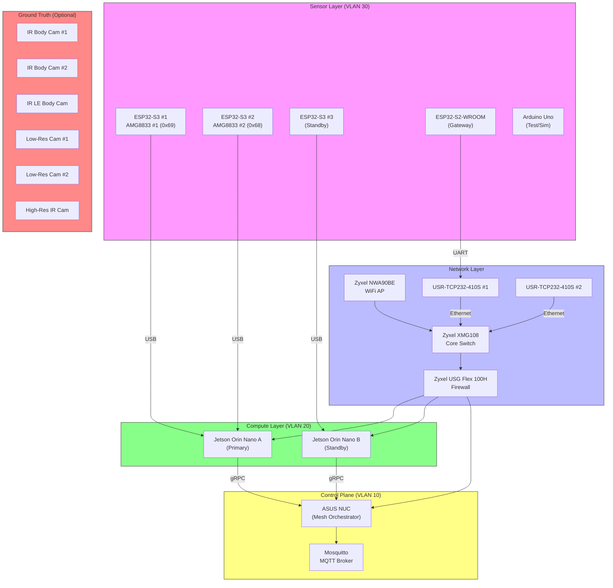
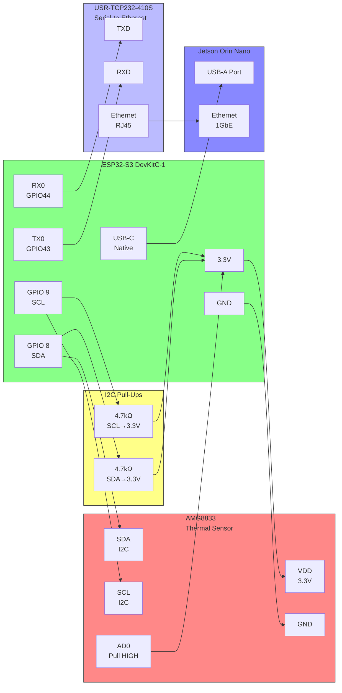
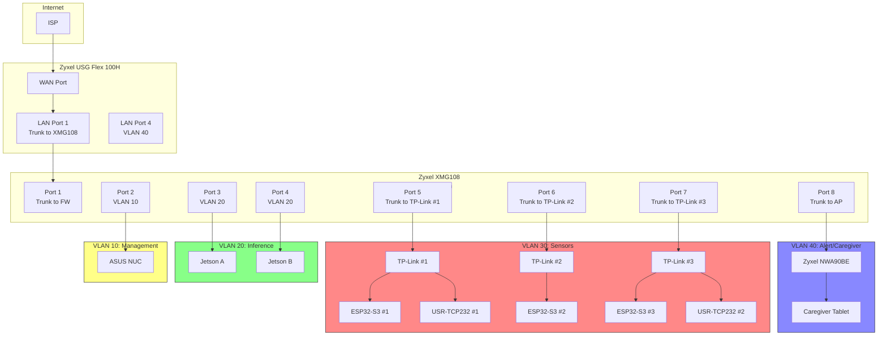
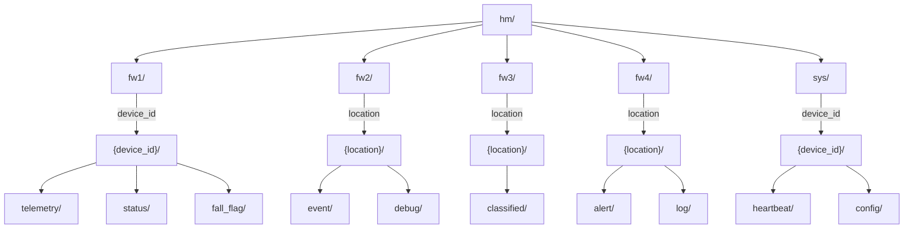
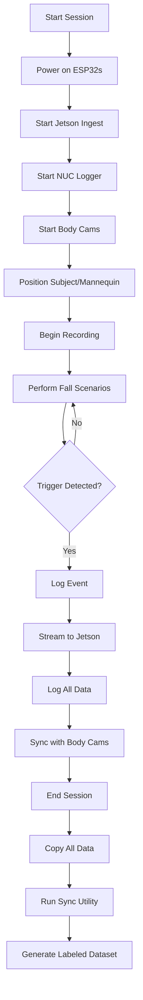
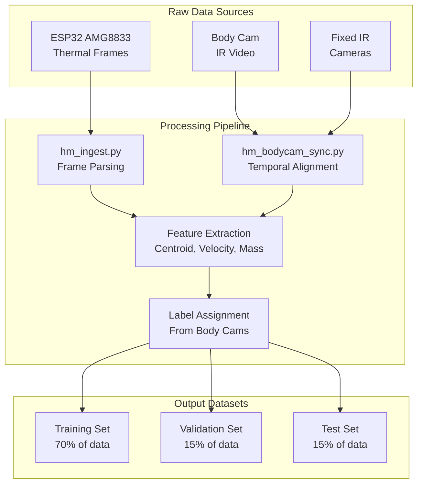

# HeuristicMesh Deployment Architecture

**Version:** 1.1  
**Date:** 2026-08-29  
**Status:** Active  
**Hardware Inventory:** 3× ESP32-S3, 1× ESP32-S2-WROOM, 2× AMG8833, Arduino Uno, 3× IR Body Cams, 2× Low-Res Cameras, 1× High-Res IR Camera

---

## 🏗️ System Overview

HeuristicMesh is a **privacy-preserving, thermal IR-based fall detection system** with **transparent, rule-based heuristics** (no black-box ML). This document provides the complete deployment architecture including wiring diagrams, data flow, and configuration for your specific hardware.

**Note:** This deployment uses **AMG8833 sensors only** (8×8 thermal arrays). **No MLX90640 sensors are present in this configuration.** Only 2 AMG8833 sensors are available.

---

## 🎯 Design Principles

1. **Privacy First**: Thermal-only sensors, no RGB cameras in production
2. **Transparency**: All detection logic is rule-based and auditable
3. **Edge Intelligence**: Processing happens on ESP32 and Jetson, not in cloud
4. **Provenance**: Every decision is logged with full context
5. **Graceful Degradation**: System continues working if components fail

---

## 🖼️ Architecture Diagrams

### 1. High-Level System Architecture



### 2. Data Flow Architecture

```mermaid
flowchart TD
    subgraph ESP32["ESP32-S3 Sensor Node"]
        A1[AMG8833 Poll\n@20Hz] --> A2[Centroid Calculation]
        A2 --> A3[Velocity Estimation]
        A3 --> A4{Fall Candidate?}
        A4 -->|Yes| A5[Send Alert]
        A4 -->|No| A1
    end
    
    subgraph Transport["Transport Layer"]
        A1 -->|USB Serial| B1[Binary Protocol]
        A5 -->|USB Serial| B1
        B1 -->|Direct| C1[Jetson]
    end
    
    subgraph Jetson["Jetson Orin Nano"]
        C1 --> C2[Framework 2:\nSpatial Analysis]
        C2 --> C3[Framework 3:\nEvent Classification]
        C3 --> C4[Confidence Scoring]
    end
    
    subgraph NUC["ASUS NUC"]
        C4 --> D1[Framework 4:\nResponse/Alert]
        D1 --> D2[Provenance Logger]
        D2 --> D3[MQTT Publisher]
        D3 --> D4[Alert Router]
    end
    
    subgraph Output["Output"]
        D4 --> E1[Caregiver Tablet\n(VLAN 40)]
        D4 --> E2[EMS/911 API]
        D4 --> E3[Local Audible Alarm]
    end
    
    subgraph GroundTruth["Ground Truth Sync"]
        BC[Body Cams] --> F1[hm_bodycam_sync.py]
        HC[IR Cameras] --> F1
        F1 --> F2[Labeled CSV]
        F2 --> D2
    end
```

### 3. Hardware Wiring Diagram (ESP32-S3 + AMG8833)



**I2C Address Configuration:**
- AMG8833 #1: AD0 = HIGH → Address = **0x69**
- AMG8833 #2: AD0 = LOW → Address = **0x68**

### 4. VLAN and Network Topology



### 5. MQTT Topic Hierarchy



---

## 🛠️ Hardware Configuration

### ESP32-S3 Configuration (x3)

| Device | ESP32 Model | Sensor | Connection | Role |
|--------|-------------|--------|------------|------|
| Node 1 | ESP32-S3 | AMG8833 #1 (0x69) | USB to Jetson A | Primary Room A |
| Node 2 | ESP32-S3 | AMG8833 #2 (0x68) | USB to Jetson A | Primary Room B |
| Node 3 | ESP32-S3 | None | USB to Jetson B | Standby/Secondary |
| Gateway | ESP32-S2-WROOM | None | UART to USR-TCP232 | Serial-to-Ethernet |

**ESP32-S3 Pinout (Recommended):**
| Function | GPIO | Notes |
|----------|------|-------|
| I2C SDA | 8 | 4.7kΩ pull-up to 3.3V |
| I2C SCL | 9 | 4.7kΩ pull-up to 3.3V |
| UART TX | 43 | For USR-TCP232 |
| UART RX | 44 | For USR-TCP232 |
| Status LED | 2 | Active low |

### AMG8833 Configuration

| Sensor | I2C Address | Mount Location | Coverage |
|--------|--------------|----------------|----------|
| AMG8833 #1 | 0x69 | Ceiling, Room A | 3m × 3m floor area |
| AMG8833 #2 | 0x68 | Ceiling, Room B | 3m × 3m floor area |

**Mounting Specifications:**
- Height: 2.4-2.8m above floor
- Angle: 30-45° downward tilt
- FOV: ~60° horizontal, ~60° vertical
- Coverage: ~3m × 3m at 2.5m height

**Note:** Only 2 AMG8833 sensors are deployed. ESP32-S3 #3 is standby without a sensor.

---

## 📡 Communication Protocols

### 1. Direct USB Serial (Primary)
- **Baud Rate:** 921600 (for high-speed) or 115200 (standard)
- **Protocol:** Unified Binary Protocol (see PROTOCOL_SPECIFICATION.md)
- **Connection:** ESP32 USB-CDC → Jetson USB-A
- **Use Case:** High-speed, low-latency data transfer

### 2. Serial-to-Ethernet via USR-TCP232
- **Baud Rate:** 115200 (UART side)
- **Ethernet:** 100Mbps
- **Protocol:** ModBus/TCP or Raw TCP
- **Port:** 502 (ModBus/TCP) or custom port
- **Use Case:** Remote sensor nodes, VLAN isolation

**USR-TCP232 Configuration:**
```
Device IP: 192.168.30.X (VLAN 30)
Subnet: 255.255.255.0
Gateway: 192.168.30.1
Port: 502 (ModBus/TCP)
Protocol: TCP Server
Baud Rate: 115200
Data Bits: 8
Stop Bits: 1
Parity: None
Flow Control: None
```

### 3. MQTT (Optional)
- **Broker:** Mosquitto on ASUS NUC (VLAN 10)
- **Port:** 1883 (plain) or 8883 (TLS)
- **QoS:** 1 for critical messages, 0 for telemetry
- **Retain:** True for status messages, False for data
- **Use Case:** Status monitoring, alerts, slow telemetry

---

## 🎯 Data Capture Workflow

### Phase 1: Baseline Capture (Current Priority)



### Phase 2: Training Data Generation



---

## 📊 Heuristic Algorithm (Transparent Rules)

### Fall Detection Logic (Framework 1 - ESP32)

```
Input: AMG8833 frame (64 pixels @ 20Hz)
       
1. Compute Centroid:
   - Filter pixels > 27.5°C (human threshold)
   - Calculate weighted average (x, y)
   - Compute thermal mass (sum of filtered pixel values)
   
2. Compute Velocity:
   - Δx = current.x - previous.x
   - Δy = current.y - previous.y
   - velocity = √(Δx² + Δy²) / Δt
   
3. Fall Candidate Detection:
   IF velocity > 1.8 pixels/frame
   AND centroid.y < 4.0 (upper half of FOV)
   AND Δy > 1.4 pixels (downward movement)
   AND hot_pixel_count >= 3
   AND persistence >= 4 frames
   THEN trigger fall candidate
```

### Spatial Analysis (Framework 2 - Jetson)

```
Input: AMG8833 frames (20Hz continuous)

1. Temporal Analysis:
   - Track centroid across frames
   - Compute velocity profile
   - Detect acceleration peaks
   
2. Confidence Scoring:
   - Base confidence: 0.5
   - +0.1 per frame with fall candidate flag
   - +0.05 per 0.1 pixels/frame velocity above threshold
   - +0.1 if impact detected (sudden stop)
   - +0.1 if post-fall immobility detected
   
   Final confidence = min(0.95, base + modifiers)
```

### Event Classification (Framework 3 - Jetson)

```
Input: Framework 2 output (confidence, features)

Classification Rules:
- IF confidence > 0.8 AND velocity_peak > 2.0 pixels/frame:
    → CLASSIFY as "FALL"
- ELSE IF confidence > 0.6 AND velocity_peak > 1.5 pixels/frame:
    → CLASSIFY as "NEAR_FALL"
- ELSE IF confidence > 0.4:
    → CLASSIFY as "SUSPICIOUS_ACTIVITY"
- ELSE:
    → CLASSIFY as "NOISE"

Output: classification, confidence, timestamp, features
```

### Response/Alert (Framework 4 - NUC)

```
Input: Framework 3 classification

Alert Rules:
- IF classification == "FALL" AND confidence > 0.85:
    → IMMEDIATE alert to EMS
- ELSE IF classification == "FALL" AND confidence > 0.7:
    → Alert to caregiver + local alarm
- ELSE IF classification == "NEAR_FALL":
    → Log event, notify caregiver (low priority)
- ELSE:
    → Log only

Provenance Logging:
- Store: timestamp, device_id, raw_frame_hash, 
         centroid_trace, velocity_profile, 
         classification, confidence, alert_action
```

---

## 📦 Dataset Structure

### Dataset Format Specifications

#### 1. Thermal Frame (JSON)
```json
{
  "timestamp_us": 1723402533412000,
  "device_id": "ESP32-S3-001",
  "sensor_type": "AMG8833",
  "frame_id": 12345,
  "resolution": [8, 8],
  "pixels": [22.1, 22.3, ..., 27.8],
  "metadata": {
    "max_temp": 27.8,
    "avg_temp": 23.5,
    "hot_pixel_count": 5,
    "centroid": {"x": 3.2, "y": 2.8, "valid": true},
    "velocity": 1.85,
    "mass": 45.2,
    "fall_candidate": true
  }
}
```

#### 2. Feature Vector (CSV)
```csv
frame_id,timestamp_us,device_id,scenario_id,centroid_x,centroid_y,velocity,acceleration,hot_pixel_count,mass,fall_candidate,label
12345,1723402533412000,ESP32-S3-001,S01,3.2,2.8,1.85,2.1,5,45.2,1,FALL
12346,1723402533462000,ESP32-S3-001,S01,3.3,3.1,2.01,2.3,6,46.8,1,FALL
...
```

#### 3. Label File (CSV)
```csv
frame_id,scenario_id,label,confidence,annotator,timestamp_annotation
12345,S01,FALL,0.95,bodycam_sync,1723402533412000
12346,S01,FALL,0.95,bodycam_sync,1723402533462000
12347,S01,FALL,0.92,bodycam_sync,1723402533512000
...
```

### Scenario Distribution

| Scenario | Type | Training | Validation | Test | Total |
|----------|------|----------|------------|------|-------|
| S01 Forward Trip | Common | 5 | 1 | 1 | 7 |
| S02 Sit-to-Stand Failure | Common | 5 | 1 | 1 | 7 |
| S03 Lateral Slip | Common | 5 | 1 | 1 | 7 |
| S04 Forward Fall (Head-Risk) | High-Impact | 3 | 1 | 0 | 4 |
| S05 Rotation + Fall | High-Impact | 4 | 1 | 1 | 6 |
| S06 Slow Syncope | **Elusive** | 7 | 2 | 1 | 10 |
| S07 Fall from Bed | Elusive | 5 | 1 | 1 | 7 |
| S08 Near-Fall + Collapse | Elusive | 5 | 1 | 1 | 7 |
| S09 Fall with Object | Elusive | 4 | 1 | 0 | 5 |
| S10 Controlled Descent | **Negative** | 5 | 1 | 1 | 7 |
| **Total** | | **48** | **10** | **7** | **65** |

**Note:** S06 (Slow Syncope) gets extra weight as it's the most elusive case.

---

## 🎛️ Configuration Files

### 1. `config/device_config.yaml`
```yaml
# Device Configuration
devices:
  ESP32-S3-001:
    model: esp32-s3
    sensor: amg8833
    i2c_address: 0x69
    connection: usb
    port: /dev/ttyACM0
    baud: 921600
    location: roomA
    role: primary
    
  ESP32-S3-002:
    model: esp32-s3
    sensor: amg8833
    i2c_address: 0x68
    connection: usb
    port: /dev/ttyACM1
    baud: 921600
    location: roomB
    role: primary
    
  ESP32-S3-003:
    model: esp32-s3
    sensor: none
    connection: usb
    port: /dev/ttyACM2
    baud: 921600
    location: standby
    role: standby
```

### 2. `config/sensor_thresholds.yaml`
```yaml
# Thermal Detection Thresholds

# Human detection
human_temp_threshold: 27.5      # Minimum temp for human (degrees C)
hot_pixel_min_count: 3         # Minimum hot pixels for valid detection

# Centroid tracking
centroid_history: 8           # Number of historical centroids to track
centroid_upper_half: 4.0      # y < 4.0 for fall candidate (0-7 range)

# Fall detection
velocity_trigger: 1.8         # Velocity threshold (pixels/frame)
persistence_frames: 4         # Consecutive frames above threshold
centroid_downward_delta: 1.4  # Minimum downward movement

# Confidence scoring (computed on Jetson)
base_confidence: 0.5
velocity_weight: 0.05         # Per 0.1 pixels/frame above threshold
persistence_weight: 0.1      # Per frame
impact_weight: 0.1            # If sudden stop detected
immobility_weight: 0.1       # If post-fall stillness

# Frame timing
frame_interval_ms: 50        # AMG8833 poll interval (~20Hz)

# Alert thresholds
fall_confidence_threshold: 0.85  # Minimum confidence for alert
near_fall_threshold: 0.6        # Minimum for near-fall
```

### 3. `config/mqtt_config.yaml`
```yaml
# MQTT Configuration
broker:
  host: 192.168.10.100      # NUC IP (VLAN 10)
  port: 1883
  tls_port: 8883
  
security:
  username: heuristicmesh
  password: <secure-password>
  tls:
    enabled: true
    ca_cert: /etc/mosquitto/certs/ca.crt
    client_cert: /etc/mosquitto/certs/client.crt
    client_key: /etc/mosquitto/certs/client.key

# Topic subscriptions
subscriptions:
  - topic: hm/fw1/+/telemetry
    qos: 1
  - topic: hm/fw1/+/status
    qos: 1
  - topic: hm/fw1/+/fall_flag
    qos: 1
  - topic: hm/fw2/+/event
    qos: 1
  - topic: hm/fw3/+/classified
    qos: 1

# Topic publications
publications:
  - topic: hm/fw4/+/alert
    qos: 1
    retain: false
  - topic: hm/sys/+/heartbeat
    qos: 1
    retain: true
```

---

## 🚀 Quick Start Guide

### Step 1: Hardware Setup

1. **Mount AMG8833 sensors:**
   - Install at 2.5m height, 30-45° downward angle
   - Ensure clear FOV (no obstructions)
   - Connect I2C with 4.7kΩ pull-ups

2. **Connect ESP32s:**
   - ESP32-S3 #1 → Jetson A (USB) - AMG8833 #1 (0x69)
   - ESP32-S3 #2 → Jetson A (USB) - AMG8833 #2 (0x68)
   - ESP32-S3 #3 → Jetson B (USB) - Standby
   - ESP32-S2 → USR-TCP232 #1 (UART) - Gateway

3. **Network Configuration:**
   - Configure Zyxel XMG108 with VLANs 10, 20, 30, 40
   - Set up USG Flex 100H firewall rules
   - Assign static IPs to all devices

### Step 2: Software Setup

1. **Flash ESP32s:**
   ```bash
   cd esp32
   pio run -t upload -e esp32-s3-devkitc-1
   ```

2. **Set up NUC:**
   ```bash
   sudo ./setup_mosquitto.sh
   ```

3. **Start Jetson Ingest:**
   ```bash
   cd jetson
   python3 hm_ingest_amg_only.py --port /dev/ttyACM0 --baud 921600
   ```

### Step 3: Baseline Capture

1. **Start session:**
   ```bash
   cd scripts
   ./start_capture_session.sh roomA S01
   ```

2. **Perform scenarios** using mannequin/surrogate
3. **Sync body cams:**
   ```bash
   python3 hm_bodycam_sync.py
   ```

4. **Generate dataset:**
   ```bash
   python3 capture_session.py --input bodycam_footage/ --output dataset/
   ```

### Step 4: Tune Thresholds

1. **Analyze baseline:**
   ```bash
   python3 analyze_baseline.py --dataset dataset/training/
   ```

2. **Update thresholds:**
   ```yaml
   # Edit config/sensor_thresholds.yaml based on analysis
   ```

3. **Validate:**
   ```bash
   python3 validate_thresholds.py --dataset dataset/validation/
   ```

---

## 🛡️ Troubleshooting

### Common Issues

| Issue | Cause | Solution |
|-------|-------|----------|
| ESP32 not detected | USB driver issue | Install CP210x driver |
| I2C scan fails | Wiring error | Check pull-ups, connections |
| No fall detection | Thresholds too high | Lower `velocity_trigger` |
| False positives | Thresholds too low | Increase `velocity_trigger` or `persistence_frames` |
| USR-TCP232 not connecting | IP/config issue | Verify USR-TCP232 settings |

### Debug Commands

```bash
# Check USB devices
ls /dev/tty*

# Test serial communication
screen /dev/ttyACM0 115200

# Monitor MQTT
mosquitto_sub -h localhost -t 'hm/#' -v

# Check network connectivity
ping 192.168.30.10

# View logs
journalctl -u mosquitto -f
tail -f /var/log/heuristicmesh/*.log
```

---

## 📚 References

- [Protocol Specification](PROTOCOL_SPECIFICATION.md)
- [Hardware Configuration](HARDWARE_CONFIGURATION.md)
- [Network Security Architecture](NETWORK_SECURITY_ARCHITECTURE.md)
- [Nebula Cloud Configuration](NEBULA_CONFIGURATION_GUIDE.md)

---

**Document Status:** ✅ Active  
**Owner:** Engineering Team  
**Last Updated:** 2026-08-29  
**Version:** 1.1
