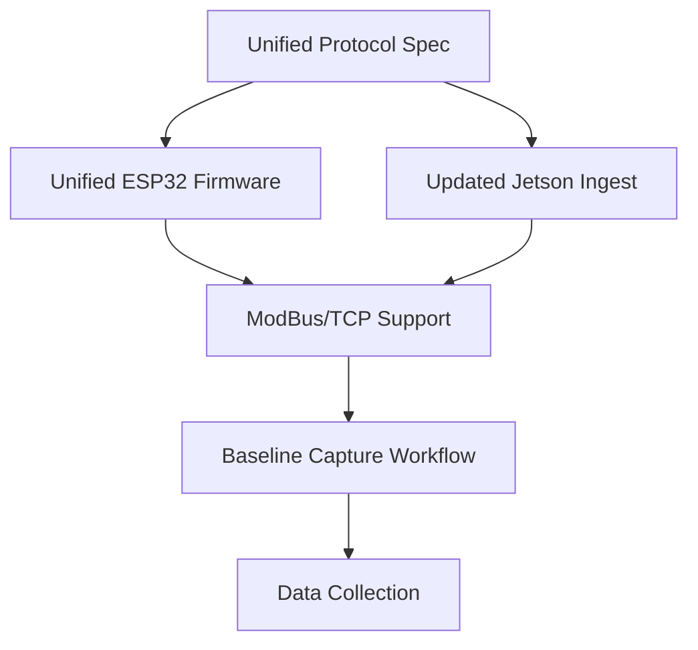

# Gap Analysis - HeuristicMesh Edge Device Configuration

## Executive Summary

The current codebase has **three different ESP32 firmware variants** with **incompatible protocols**, **no Serial-to-Ethernet ModBus integration**, and **missing end-to-end data capture workflows**. This document identifies all gaps and provides an action plan to unify the edge device stack.

---

## 🔍 1. PROTOCOL GAPS

### Current State: THREE Incompatible Protocols

| Location | Protocol | Magic Byte | Packet Size | Payload | Status |
|----------|----------|------------|-------------|---------|--------|
| `esp32/src/main.cpp` | Binary v1 | `0xA5` | 19 bytes | AMG8833 centroid data | ✅ Used by `hm_ingest.py` |
| `src/main.cpp` | Binary v2 | `0xAA 0xBB` | 3083 bytes |  full frame (768 floats) | ❌ Used by `sneak-peak.py` |
| `docs/HeuristicMesh_Sensor_Concentrator.md` | Binary v3 | `0xAA 0xBB` | 3083 bytes |   (24 frames) | ❌ Not implemented in any receiver |

### Issues
- **No single protocol** works across all components
- **Jetson ingest** (`hm_ingest.py`) only handles v1 (AMG8833-only)
- **No  support** in production ingest pipeline
- **No ModBus/TCP** (USR-TCP232) support anywhere
- **No MQTT** on ESP32 (only mentioned in docs)

### Required Actions
1. ✅ Define **unified binary protocol** (backward compatible)
2. ✅ Create **protocol specification document**
3. ✅ Implement **ModBus/TCP wrapper** for Serial-to-Ethernet
4. ✅ Update **Jetson ingest** to handle all sensor types

---

## 🔍 2. ESP32 FIRMWARE GAPS

### Current State: Two Incomplete Implementations

| File | AMG8833 |  | Protocol | I2C Error Handling | ModBus | MQTT |
|------|---------|----------|----------|-------------------|--------|------|
| `esp32/src/main.cpp` | ✅ Yes | ❌ No | `0xA5` (19B) | ❌ None | ❌ No | ❌ No |
| `src/main.cpp` | ✅ Yes | ✅ Yes | `0xAA 0xBB` (3083B) | ❌ None | ❌ No | ❌ No |
| `docs/HeuristicMesh_Sensor_Concentrator.md` | ✅ Yes | ✅ Yes | `0xAA 0xBB` (3083B) | ❌ None | ❌ No | ❌ No (stubbed) |

### Issues
- **No unified firmware** combining best features
- **No error recovery** for I2C bus failures
- **No configuration** for sensor addresses, thresholds
- **No ModBus/TCP** support (USR-TCP232)
- **No MQTT** client (mentioned in docs but not implemented)
- **No OTA** update capability

### Required Actions
1. ✅ Create **unified firmware** (`esp32/src/main.cpp`)
2. ✅ Add **I2C error recovery** with bus reset
3. ✅ Add **configuration** via serial commands
4. ✅ Add **ModBus/TCP** compatibility layer
5. ✅ Add **MQTT** option (WiFi or Ethernet via USR-TCP232)

---

## 🔍 3. SERIAL-TO-ETHERNET MODBUS GAPS

### Current State: Not Implemented

The **USR-TCP232-410S** is mentioned in:
- `docs/HeuristicMesh_Framework_3.5.md` (MQTT over TLS, port 8883)
- `setup_mosquitto.sh` (firewall rules for VLAN30 → VLAN10)

But **no implementation exists** for:
- ESP32 → USR-TCP232 serial communication
- USR-TCP232 → Ethernet → MQTT broker
- ModBus/TCP protocol handling

### Issues
- **No ModBus/TCP support** in any component
- **No configuration** for USR-TCP232 device
- **No MQTT client** on ESP32 side
- **No fallback** between direct serial and Ethernet

### Required Actions
1. ✅ Define **ModBus/TCP message mapping** for HeuristicMesh
2. ✅ Create **USR-TCP232 configuration guide**
3. ✅ Implement **ModBus/TCP client** on Jetson side
4. ✅ Add **Ethernet fallback** in ESP32 firmware

---

## 🔍 4. JETSON INGEST GAPS

### Current State: AMG8833-Only

`jetson/hm_ingest.py`:
- ✅ Handles binary protocol v1 (`0xA5`, 19 bytes)
- ✅ Framework 2 spatial analysis (centroid-based)
- ❌ No  frame processing
- ❌ No ModBus/TCP support
- ❌ No MQTT subscriber
- ❌ No multi-sensor aggregation

### Issues
- **Cannot process**  high-res frames
- **No ModBus/TCP** client to receive from USR-TCP232
- **No MQTT** subscriber for sensor data
- **No support** for multiple ESP32 devices

### Required Actions
1. ✅ Update `hm_ingest.py` to handle **unified protocol**
2. ✅ Add ** frame processing**
3. ✅ Add **ModBus/TCP client** support
4. ✅ Add **MQTT subscriber** option
5. ✅ Add **multi-device aggregation**

---

## 🔍 5. DOCUMENTATION GAPS

### Missing Documents
| Document | Status | Priority |
|----------|--------|----------|
| Unified Protocol Specification | ❌ Missing | 🔴 High |
| ESP32 Firmware Architecture | ❌ Missing | 🔴 High |
| Serial-to-Ethernet Deployment Guide | ❌ Missing | 🔴 High |
| End-to-End Data Capture Workflow | ❌ Missing | 🔴 High |
| Wiring Diagrams | ❌ Missing | 🟡 Medium |
| Configuration Reference | ❌ Missing | 🟡 Medium |

### Required Actions
1. ✅ Create **PROTOCOL_SPECIFICATION.md**
2. ✅ Create **DEPLOYMENT_GUIDE.md**
3. ✅ Create **data capture workflow** documentation
4. ✅ Add **Mermaid diagrams** for architecture

---

## 🎯 ACTION PLAN (Priority Order)

### Phase 1: Protocol Unification (This Week)
- [ ] **Create `docs/PROTOCOL_SPECIFICATION.md`** - Unified binary protocol
- [ ] **Create `esp32/src/main_unified.cpp`** - Merged firmware
- [ ] **Update `jetson/hm_ingest.py`** - Handle unified protocol
- [ ] **Create `docs/DEPLOYMENT_ARCHITECTURE.md`** - With diagrams

### Phase 2: ModBus/TCP Integration (Next Week)
- [ ] **Create `docs/MODBUS_INTEGRATION.md`** - USR-TCP232 guide
- [ ] **Add ModBus/TCP support** to ESP32 firmware
- [ ] **Add ModBus/TCP client** to Jetson ingest
- [ ] **Create configuration files** for USR-TCP232

### Phase 3: Baseline Data Capture (Following Week)
- [ ] **Create `scripts/capture_baseline.py`** - Automated data collection
- [ ] **Create `docs/BASELINE_CAPTURE_GUIDE.md`** - Step-by-step
- [ ] **Add data validation** scripts
- [ ] **Create sample configuration** files

### Phase 4: Advanced Features (Future)
- [ ] Add MQTT support to ESP32
- [ ] Add OTA update capability
- [ ] Add multi-sensor synchronization
- [ ] Add error recovery and self-healing

---

## 📊 SUCCESS CRITERIA

### Phase 1 Complete When:
- ✅ Single ESP32 firmware handles AMG8833 + 
- ✅ Single protocol works with all receivers
- ✅ Jetson can ingest both sensor types
- ✅ Architecture diagrams exist and are accurate

### Phase 2 Complete When:
- ✅ USR-TCP232 configuration is documented
- ✅ ESP32 can send via Serial-to-Ethernet
- ✅ Jetson can receive via ModBus/TCP
- ✅ End-to-end test passes

### Phase 3 Complete When:
- ✅ Baseline data capture script works
- ✅ Data validation scripts exist
- ✅ Documentation allows new users to capture data
- ✅ Sample configurations provided

---

## 🔗 DEPENDENCIES

---

## 📝 NEXT STEPS

**Immediate (Today):**
1. Create `docs/PROTOCOL_SPECIFICATION.md`
2. Create unified ESP32 firmware
3. Update Jetson ingest

**Short-term (This Week):**
4. Create architecture diagrams
5. Test end-to-end with AMG8833 + 

**Medium-term (Next Week):**
6. Add ModBus/TCP integration
7. Create deployment guide
8. Create baseline capture workflow

---

**Document Status:** ✅ Approved  
**Owner:** Engineering Team  
**Last Updated:** 2026-08-29  
**Next Review:** After Phase 1 completion
