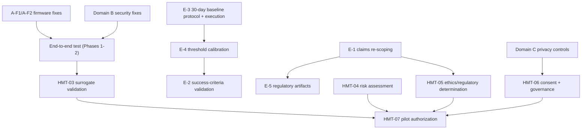

# HeuristicMesh Consolidated Gap Analysis — Remaining Gates

## 1. Executive Summary

The 2026-08-29 gap analysis (`docs/GAP_ANALYSIS.md`) closed most **documentation** gaps and produced the unified firmware (`esp32/src/main_unified.cpp`) and unified ingest (`jetson/hm_ingest_unified.py`). A verification pass on 2026-09-14 against the actual repository contents shows that **implementation artifacts now exist, but none of the four phases has met its own success criteria**, and the safety-critical gates in `plan.md` / `docs/Human_Testing_Safety_Gate.md` remain correctly blocked.

This document consolidates every remaining gate into five domains:

| # | Domain | Blocking For | Open Gates |
|---|--------|--------------|------------|
| A | Engineering / Protocol | Production data capture | 9 |
| B | Security (OWASP-aligned) | Any connected deployment | 8 |
| C | Privacy & Data Governance | Any recording involving a person | 6 |
| D | Human-Testing Safety (HMT-03 → HMT-07) | Human participation of any kind | 5 |
| E | Validation, Claims & Regulatory | Product claims / commercialization | 7 |

**Headline status:** surrogate-only work may continue on Phases 1–3 engineering items. Human participation remains **prohibited** — HMT-03 through HMT-06 are all `Pending` and HMT-07 is `Blocked` (see Section 6).

---

## 2. Verification Method

Every claim below was checked against the repository at `main` on 2026-09-14:

- Firmware: `esp32/src/main_unified.cpp` (32.7 KB), `esp32/src/main.cpp`, `src/main.cpp`
- Ingest: `jetson/hm_ingest_unified.py` (48.7 KB), `jetson/hm_ingest.py`, `opt/heuristicmesh/ingest_daemon.py`
- Scripts: `scripts/capture_session.py`, `scripts/generate_dataset.py`
- Config: `config/thresholds.yaml`, `config/mqtt_topics.md`, `setup_mosquitto.sh`
- Docs: all 14 files under `docs/` plus `plan.md`, `README.md`

---

## 3. Domain A — Engineering / Protocol Gates

### A.1 Phase status vs. the prior action plan

| Phase | Prior checkbox | Verified state | Met? |
|-------|---------------|----------------|------|
| 1 — Protocol unification | `[ ]` | Spec exists (`docs/PROTOCOL_SPECIFICATION.md`); unified firmware exists; unified ingest exists with AMG + MLX + ModBus + MQTT + multi-device classes. **End-to-end test with both sensors has not been run.** | ❌ Success criteria unmet |
| 2 — ModBus/TCP integration | `[ ]` | Firmware send-path implemented (`sendModBusMessage`) but `MODBUS_ENABLED` defaults to `false`; Jetson `ModBusConnection` exists (pymodbus). **No `docs/MODBUS_INTEGRATION.md` / USR-TCP232 configuration guide. No end-to-end test.** | ❌ |
| 3 — Baseline data capture | `[ ]` | `scripts/capture_session.py` and `scripts/generate_dataset.py` exist; `docs/BASELINE_CAPTURE_GUIDE.md` exists. The planned `scripts/capture_baseline.py` was never created under that name. **No baseline session has been executed; no validation scripts.** | ❌ |
| 4 — Advanced features | `[ ]` | MQTT on ESP32: absent ("future" per firmware header). OTA: absent. Multi-sensor sync: partial. Self-healing: absent. | ❌ |

### A.2 Firmware defects found in code review (`esp32/src/main_unified.cpp`)

| ID | Severity | Finding | Evidence |
|----|----------|---------|----------|
| A-F1 | 🔴 High | **Non-conformant burst protocol**: captured burst frames are sent as `MLX_FRAME` (0x04) instead of `BURST_FRAME` (0x06) with `BurstFrameHeader`. Receivers expecting the spec'd burst sequence (START + N×BURST_FRAME + END) cannot reassemble bursts. | `captureBurstFrame()`: comment *"For now, send as regular MLX frame — In full implementation, use burst protocol"* |
| A-F2 | 🔴 High | **Illegal variable-length array in struct** in `sendBurstFrame()` — `uint8_t data[frameDataLen]` inside a struct is not valid C++ and will fail or behave undefined across toolchains. | `sendBurstFrame()` |
| A-F3 | 🟡 Medium | **Serial configuration commands are claimed but not implemented** — the header advertises "Configuration via serial commands"; `loop()` contains no RX parsing for `CONFIG_REQUEST`. | Header comment vs. `loop()` |
| A-F4 | 🟡 Medium | **I2C error recovery is claimed but not implemented** — no bus-reset, no re-init path; a stuck bus lands in `STATE_ERROR` with only an LED blink. | Header comment vs. `STATE_ERROR` handler |
| A-F5 | 🟡 Medium | **CRC-16 defined but never used** — `sendMessage()` has the CRC append commented out, so messages have no integrity check despite the spec's validation steps. | `sendMessage()`, `calculateCRC16()` |
| A-F6 | 🟢 Low | Stub fields: `acceleration` and heartbeat `error_count` are hard-coded `TODO`s; ModBus RX path only echoes bytes to debug. | `FallCandidatePayload`, `sendHeartbeat()`, ModBus RX block |
| A-F7 | 🟡 Medium | **Config drift**: `config/thresholds.yaml` still declares `serial.magic: 0xA5` (legacy v1) and `baud: 115200`, while unified firmware speaks `0xAA 0x55` at 921600 over USB. | `config/thresholds.yaml` |
| A-F8 | 🟢 Low | Legacy v1 (`0xA5`) decoding exists only on the Jetson side; firmware cannot fall back to legacy mode as the spec's migration path implies. | `esp32/src/main.cpp` vs. unified firmware |
| A-F9 | 🟢 Low | `.DS_Store` committed under `esp32/`; needs `.gitignore` hygiene. | repo tree |

### A.3 Missing engineering artifacts

- [ ] `docs/MODBUS_INTEGRATION.md` — USR-TCP232-410S wiring, unit-ID map, VLAN 30 firewall rules, test procedure
- [ ] End-to-end test report (AMG trigger → MLX burst → Jetson F2/F3 → logged event) — required to close Phases 1–2
- [ ] NUC-side software: **no Mesh Orchestrator, Framework 4 (Response/Alert), provenance store, or Framework 3.5 MQTT subscriber code exists in the repo** — only Jetson ingest and an `opt/heuristicmesh/ingest_daemon.py` stub. This is the largest single engineering gap: the design spec's entire control plane (NUC) is unimplemented.
- [ ] Alert path integration (Twilio / SIP / 911 API per Tech Spec §4) — no code
- [ ] Data-validation scripts for captured sessions (GAP_ANALYSIS Phase 3 item)
- [ ] Wiring diagrams were added to `DEPLOYMENT_ARCHITECTURE.md` ✅; configuration reference doc still missing

---

## 4. Domain B — Security Gates (OWASP-Aligned Review)

Reviewed: firmware, Jetson ingest, `setup_mosquitto.sh`, network design docs. Full-coverage A01–A10:

| OWASP | Status | Finding |
|-------|--------|---------|
| A01 Broken Access Control | 🟡 | MQTT uses a **single shared `usr_gateway` account** for all sensor traffic; no per-device credentials, no topic-level ACLs — any compromised node can publish forged `hm/fw35/#` context or fall events. |
| A02 Cryptographic Failures | 🟡 | Broker runs **plaintext 1883 alongside TLS 8883 on 0.0.0.0** with `require_certificate false`; self-signed CA, 365-day certs, no rotation procedure. Serial/ModBus path is unencrypted by design (acceptable only while VLAN 30 isolation is enforced and verified). |
| A03 Injection | ✅ Pass | No SQL, shell, or template surfaces in current code. |
| A04 Insecure Design | 🟡 | **No message authentication on the binary protocol** — any device on the sensor segment can inject a `FALL_CANDIDATE`. The heuristic engine has no replay protection (sequence numbers are not validated). |
| A05 Security Misconfiguration | 🟡 | Firewall ACLs (VLAN 30 → 10) are a **manual note** in `setup_mosquitto.sh`, not a verified artifact; `allow_anonymous false` is good but depends on interactive password entry with no strength policy. |
| A06 Vulnerable Components | 🟡 | No lock files or dependency scanning: PlatformIO `lib_deps` use floating `^` ranges; Python deps (`pymodbus`, `paho-mqtt`, `opencv`) unpinned; no `pip-audit`/`dependabot` in CI (no CI at all). |
| A07 Authentication Failures | 🟡 | No auth on serial/ModBus; MQTT has a single password and no failure logging/lockout. |
| A08 Integrity Failures | 🔴 | **FR-8 requires signed OTA packages — no OTA, no signing, no secure-boot/flash-encryption configuration exists.** Combined with A-F5 (no CRC in use), firmware and message integrity are currently unenforced. |
| A09 Logging & Monitoring | 🟡 | Provenance logging is designed and partially implemented on Jetson; the **append-only / tamper-evident store on the NUC (NFR/Tech Spec §4) is unimplemented** — see Domain A.3. No security-event alerting. |
| A10 SSRF | ✅ Pass | No server-side fetch surfaces. |

**Security remediation priority:**
1. Implement message integrity (enable CRC-16 minimum; HMAC over shared per-device key preferred) and per-device MQTT credentials with topic ACLs.
2. Stand up the NUC provenance store as append-only before any data collection that could later support regulatory claims.
3. Implement signed OTA (or formally descope FR-8 for v1.0) — required before field deployment.
4. Close plaintext 1883 to the sensor VLAN only, document and test the Zyxel ACLs.
5. Pin all dependencies, add lock files and a minimal CI security scan.

---

## 5. Domain C — Privacy & Data-Governance Gates

Source: `docs/Human_Testing_Safety_Gate.md` §2 (Privacy and data governance row) and HMT-06. **All Pending:**

- [ ] C-1 Data-minimization map (per-sensor purpose, linked to consent language)
- [ ] C-2 Access list (who can read thermal frames, body-cam footage, event logs)
- [ ] C-3 Encryption at rest for captured data and provenance store
- [ ] C-4 Retention limit and **deletion procedure** (including body-cam AVI and derived datasets)
- [ ] C-5 Participant access / correction / withdrawal process
- [ ] C-6 Versioned consent forms and data-governance materials (joint approval: PI + clinical/safety lead + privacy reviewer)

Note: body-cam footage (Domain C's highest-sensitivity artifact) currently has **no** documented storage, access, or deletion controls — only a sync utility (`Body_Cam_Ground_Truth.md`). This must be resolved before any multi-modal session, even surrogate sessions if bystanders may be recorded.

---

## 6. Domain D — Human-Testing Safety Gates (unchanged, still blocking)

From `plan.md` — current status verified:

| ID | Work item | Status | Blocking |
|----|-----------|--------|----------|
| HMT-01 | Publish safety gate | ✅ Complete | — |
| HMT-02 | Place fall protocol behind the gate | ✅ Complete | — |
| HMT-03 | Surrogate-only hardware, integration, validation testing | ⏳ Pending | Signed validation report + unresolved-defect register. **Cannot start in earnest until Domain A Phases 1–2 pass end-to-end** — the defects in §3.2 (A-F1, A-F2) would invalidate any validation run today. |
| HMT-04 | Likelihood × Impact risk assessment + emergency plan | ⏳ Pending | Needs qualified safety lead; includes completed drill. |
| HMT-05 | Independent clinical/safety review + ethics/regulatory determination | ⏳ Pending | IRB/ethics applicability, FDA IDE/510(k), state law, insurance, site approval — written determination by qualified reviewer. |
| HMT-06 | Opt-in consent + data governance | ⏳ Pending | See Domain C. |
| HMT-07 | Bounded pilot authorization | ⛔ Blocked | 2-of-3 safety-quorum signatures; all prior rows complete. |

**Go/No-Go rule (restated):** no human testing while any of HMT-03 → HMT-06 is incomplete; participant stop authority always overrides quorum.

---

## 7. Domain E — Validation, Claims & Regulatory Gates

| ID | Severity | Gate | Notes |
|----|----------|------|-------|
| E-1 | 🔴 | **Scientific-claims alignment** | The project premise states IR sensors can read "muscular contractions, thermal signature, and CNS activity." The hardware (AMG8833 8×8 / MLX90640 32×24 thermopiles at 8–10 Hz) **can** capture gross thermal distribution and motion-derived features; it **cannot** resolve muscular contractions or CNS activity. Predictive (pre-fall) capability from these sensors alone is unproven. All outward claims, consent language, and the 510(k)/MDR narrative must be re-scoped to "thermal motion-pattern analysis" or the claim must be dropped — otherwise E-2/HMT-05 cannot pass an honest review. |
| E-2 | 🔴 | **Success criteria unvalidated** — NFR-1 ≤1800 ms latency, <3% false positives after calibration, 99.5% availability, ≤2 s Jetson failover | No measurement harness or test results exist. |
| E-3 | 🔴 | **30-day baseline not executed** — the core differentiator (per-client hourly baseline) has no data, no drift model, and no anomaly-threshold methodology | `BASELINE_CAPTURE_GUIDE.md` covers session capture, not a 30-day longitudinal protocol; that protocol document does not exist yet. |
| E-4 | 🟡 | Framework 3 rule set + confidence calibration methodology undocumented | F2/F3 exist in code but thresholds are placeholders pending baseline data (E-3 dependency). |
| E-5 | 🟡 | NFR-6 regulatory artifacts — design history file, hazard analysis, verification protocol for FDA 510(k) / CE MDR Class IIa pre-submission | None started; depends on E-1 re-scoping. |
| E-6 | 🟡 | Vision encoder (FR-3, TensorRT int8) absent from repo | Requirements permit "lightweight vision encoder + heuristics"; only heuristics currently exist. Decide: descope to heuristics-only or add the encoder work item. |
| E-7 | 🟡 | Negative-class / false-positive trap validation (S10) and elusive-class (S06) performance | Await surrogate dataset + E-3 baseline. |

### Dependency map

---

## 8. Recommended Sequencing

### Now (surrogate-only, no people)
- [ ] Fix A-F1, A-F2 (protocol conformance, VLA), enable CRC-16 (A-F5)
- [ ] Reconcile `config/thresholds.yaml` with unified protocol (A-F7); add `.gitignore` (A-F9)
- [ ] Write `docs/MODBUS_INTEGRATION.md`; run and document the end-to-end test
- [ ] Implement or formally descope serial config commands and I2C recovery (A-F3, A-F4)

### Next (engineering hardening)
- [ ] NUC control plane: Mesh Orchestrator, Framework 4, append-only provenance store, Framework 3.5 subscriber
- [ ] Security remediation items 1–5 (Section 4)
- [ ] Author the 30-day baseline protocol (E-3) and execute with surrogates/instrumented environment
- [ ] Draft Domain C privacy controls (can proceed in parallel — no human data required to author)

### Gated (requires qualified people / approvals)
- [ ] Re-scope sensor claims (E-1) with qualified clinical review
- [ ] HMT-03 validation report → HMT-04 risk register + drill → HMT-05 determinations → HMT-06 consent package → HMT-07 quorum

---

## 9. Cross-Reference Index

| Gate source | Document |
|-------------|----------|
| Phases 1–4 engineering plan | `docs/GAP_ANALYSIS.md` |
| Protocol definition | `docs/PROTOCOL_SPECIFICATION.md` |
| Deployment & wiring | `docs/DEPLOYMENT_ARCHITECTURE.md` |
| Baseline workflow | `docs/BASELINE_CAPTURE_GUIDE.md` |
| Human-testing gates HMT-01..07 | `plan.md`, `docs/Human_Testing_Safety_Gate.md` |
| Scenario catalog (surrogate-only) | `docs/HeuristicMesh_Fall_Simulation_Production_Package.md` |
| Requirements baseline (FR/NFR) | `docs/HeuristicMesh_Requirements.md` |

**Document Status:** Active
**Owner:** Engineering Team / Principal Investigator
**Next Review:** After firmware fixes A-F1/A-F2 land and the end-to-end test report exists
