# HeuristicMesh - Photorealistic System Architecture Diagrams

> **Note:** The diagrams below are described in text format for rendering with diagram tools. For actual photorealistic visualizations, use the provided PlantUML, Mermaid, or Graphviz code with compatible rendering tools.

---

## 🖼️ Diagram 1: Complete System Overview (Photorealistic)

### PlantUML Code (for photorealistic rendering)

```plantuml
@startuml HeuristicMesh_System_Overview

' ============================================================================
' CONFIGURATION
' ============================================================================
set namespaceSeparator ::
skinparam monochrome false
skinparam shadowing true
skinparam defaultFontName Arial
skinparam defaultFontSize 12
skinparam componentStyle uml2
skinparam component {
    BackgroundColor #f0f0f0
    BorderColor #0066CC
    FontSize 12
    StereotypeFontSize 10
}
skinparam node {
    BackgroundColor #f0f0f0
    BorderColor #0066CC
}

' ============================================================================
' STYLES
' ============================================================================
<style>
    .sensor {
        BackgroundColor #FFE4E1
        BorderColor #FF6347
        FontColor #8B0000
    }
    .compute {
        BackgroundColor #E6E6FA
        BorderColor #4169E1
        FontColor #000080
    }
    .network {
        BackgroundColor #F0F8FF
        BorderColor #1E90FF
        FontColor #000080
    }
    .control {
        BackgroundColor #FFFACD
        BorderColor #FFD700
        FontColor #8B4513
    }
    .ground_truth {
        BackgroundColor #F5F5DC
        BorderColor #8FBC8F
        FontColor #2E8B57
    }
</style>

' ============================================================================
' DIAGRAM DEFINITION
' ============================================================================

left to right direction

' ============================================================================
' SENSOR LAYER
' ============================================================================

package "Sensor Layer" <<Node>> {
    component "ESP32-S3 #1" as ESP1 ** [
        == AMG8833 ==
        I2C: 0x69
        Poll: 20Hz
        USB: 921600 baud
    ] <<sensor>>
    
    component "ESP32-S3 #2" as ESP2 ** [
        == AMG8833 ==
        I2C: 0x68
        Poll: 20Hz
        USB: 921600 baud
    ] <<sensor>>
    
    component "ESP32-S3 #3" as ESP3 ** [
        == Standby ==
        USB: 921600 baud
    ] <<sensor>>
    
    component "ESP32-S2-WROOM" as ESP_S2 ** [
        == Gateway ==
        UART: 115200 baud
        ModBus/TCP
    ] <<sensor>>
}

' ============================================================================
' GROUND TRUTH LAYER
' ============================================================================

package "Ground Truth" <<Node>> {
    component "IR Body Cam #1" as BC1 [Chest mount] <<ground_truth>>
    component "IR Body Cam #2" as BC2 [Shoulder mount] <<ground_truth>>
    component "IR LE Body Cam" as BC3 [Waist mount] <<ground_truth>>
    component "Low-Res Cam #1" as LC1 <<ground_truth>>
    component "Low-Res Cam #2" as LC2 <<ground_truth>>
    component "High-Res IR Cam" as HC [Ceiling mount] <<ground_truth>>
}

' ============================================================================
' NETWORK LAYER
' ============================================================================

package "Network Infrastructure" <<Node>> {
    component "Zyxel USG Flex 100H" as FW ** [
        == Firewall ==
        VLAN 10: Management
        VLAN 20: Inference
        VLAN 30: Sensors
        VLAN 40: Alert
    ] <<network>>
    
    component "Zyxel GS1200" as SW ** [
        == Managed Switch ==
        1GbE ports
        VLAN-aware
    ] <<network>>
    
    component "Zyxel NWA90BE" as AP ** [
        == WiFi 6 AP ==
        5GHz only
        Caregiver tablets
    ] <<network>>
    
    component "USR-TCP232-410S #1" as USR1 ** [
        == Serial-to-Ethernet ==
        IP: 192.168.30.10
        Port: 502
        ModBus/TCP
    ] <<network>>
    
    component "USR-TCP232-410S #2" as USR2 ** [
        == Serial-to-Ethernet ==
        IP: 192.168.30.11
        Port: 502
        ModBus/TCP
    ] <<network>>
}

' ============================================================================
' COMPUTE LAYER
' ============================================================================

package "Compute Layer" <<Node>> {
    component "Jetson Orin Nano A" as JET_A ** [
        == Primary Inference ==
        TensorRT 10
        CUDA 12
        Framework 2/3
    ] <<compute>>
    
    component "Jetson Orin Nano B" as JET_B ** [
        == Standby/Load ==
        TensorRT 10
        CUDA 12
        Framework 2/3
    ] <<compute>>
}

' ============================================================================
' CONTROL LAYER
' ============================================================================

package "Control Plane" <<Node>> {
    component "ASUS NUC" as NUC ** [
        == Mesh Orchestrator ==
        Ubuntu 24.04
        Docker + k3s
        Framework 1/4
        Mosquitto MQTT
    ] <<control>>
}

' ============================================================================
' ALERT LAYER
' ============================================================================

package "Alert Layer" <<Node>> {
    component "Caregiver Tablet" as TABLET [WiFi 6] <<network>>
    component "EMS/911 API" as EMS [Internet] <<network>>
    component "Local Audible Alarm" as ALARM <<control>>
}

' ============================================================================
' CONNECTIONS
' ============================================================================

' ESP32 to Jetson (USB)
ESP1 --> JET_A : "USB 921600 baud\nBinary Protocol"
ESP2 --> JET_A : "USB 921600 baud\nBinary Protocol"
ESP3 --> JET_B : "USB 921600 baud\nBinary Protocol"

' ESP32-S2 to USR-TCP232 (UART)
ESP_S2 --> USR1 : "UART 115200 baud\nModBus/TCP"

' USR-TCP232 to Network
USR1 --> SW : "Ethernet 100Mbps\nVLAN 30"
USR2 --> SW : "Ethernet 100Mbps\nVLAN 30"

' Switch to Firewall
SW --> FW : "1GbE trunk\nAll VLANs"

' Firewall to Compute/Control
FW --> JET_A : "VLAN 20\n1GbE"
FW --> JET_B : "VLAN 20\n1GbE"
FW --> NUC : "VLAN 10\n1GbE"

' Firewall to Alert
FW --> AP : "VLAN 40\n1GbE"
AP --> TABLET : "WiFi 6\n5GHz"
FW --> EMS : "VLAN 40\nOutbound only"
NUC --> ALARM : "GPIO/Audio"

' Jetson to NUC (gRPC)
JET_A --> NUC : "gRPC 50051\nFramework 2/3"
JET_B --> NUC : "gRPC 50051\nFramework 2/3"

' NUC to MQTT
NUC --> NUC : "Mosquitto\nPort 1883/8883"

' Ground Truth (optional, for training)
BC1 -[hidden]-> JET_A
BC2 -[hidden]-> JET_A
BC3 -[hidden]-> JET_A
LC1 -[hidden]-> JET_A
LC2 -[hidden]-> JET_A
HC -[hidden]-> JET_A

' ============================================================================
' LEGEND
' ============================================================================

legend right
    | Color | Component Type |
    |-------|----------------|
    | Pink  | Sensor        |
    | Blue  | Compute       |
    | Cyan  | Network       |
    | Gold  | Control       |
    | Green | Ground Truth  |
endlegend

@enduml
```

---

### Graphviz Code (for photorealistic rendering)

```dot
// HeuristicMesh System Architecture - Graphviz
// Render with: dot -Tpng system_architecture.dot -o system_architecture.png

digraph HeuristicMesh {
    rankdir=LR;
    node [shape=box, style=filled, fontname="Arial", fontsize=12];
    edge [fontname="Arial", fontsize=10];
    
    // ========================================================================
    // STYLES
    // ========================================================================
    
    // Sensor style
    node [fillcolor="#FFE4E1", color="#FF6347", fontcolor="#8B0000"];
    
    // Subgraphs
    subgraph cluster_sensors {
        label="Sensor Layer";
        style="filled";
        fillcolor="#FFE4E1";
        color="#FF6347";
        
        ESP1 [label="ESP32-S3 #1\nAMG8833 (0x69)\n20Hz @ 921600 baud"];
        ESP2 [label="ESP32-S3 #2\nAMG8833 (0x68)\n20Hz @ 921600 baud"];
        ESP3 [label="ESP32-S3 #3\nStandby\n921600 baud"];
        ESP_S2 [label="ESP32-S2-WROOM\nGateway\nUART 115200 baud"];
    }
    
    // Ground Truth style
    node [fillcolor="#F5F5DC", color="#8FBC8F", fontcolor="#2E8B57"];
    
    subgraph cluster_ground_truth {
        label="Ground Truth";
        style="filled";
        fillcolor="#F5F5DC";
        color="#8FBC8F";
        
        BC1 [label="IR Body Cam #1\nChest mount"];
        BC2 [label="IR Body Cam #2\nShoulder mount"];
        BC3 [label="IR LE Body Cam\nWaist mount"];
        LC1 [label="Low-Res Cam #1"];
        LC2 [label="Low-Res Cam #2"];
        HC [label="High-Res IR Cam\nCeiling mount"];
    }
    
    // Network style
    node [fillcolor="#F0F8FF", color="#1E90FF", fontcolor="#000080"];
    
    subgraph cluster_network {
        label="Network Infrastructure";
        style="filled";
        fillcolor="#F0F8FF";
        color="#1E90FF";
        
        FW [label="Zyxel USG Flex 100H\nFirewall/Router\nVLAN 10/20/30/40"];
        SW [label="Zyxel GS1200\nManaged Switch\n1GbE VLAN-aware"];
        AP [label="Zyxel NWA90BE\nWiFi 6 AP\n5GHz"];
        USR1 [label="USR-TCP232-410S #1\n192.168.30.10:502\nModBus/TCP"];
        USR2 [label="USR-TCP232-410S #2\n192.168.30.11:502\nModBus/TCP"];
    }
    
    // Compute style
    node [fillcolor="#E6E6FA", color="#4169E1", fontcolor="#000080"];
    
    subgraph cluster_compute {
        label="Compute Layer";
        style="filled";
        fillcolor="#E6E6FA";
        color="#4169E1";
        
        JET_A [label="Jetson Orin Nano A\nPrimary Inference\nTensorRT 10 + CUDA 12\nFramework 2/3"];
        JET_B [label="Jetson Orin Nano B\nStandby/Load\nTensorRT 10 + CUDA 12\nFramework 2/3"];
    }
    
    // Control style
    node [fillcolor="#FFFACD", color="#FFD700", fontcolor="#8B4513"];
    
    subgraph cluster_control {
        label="Control Plane";
        style="filled";
        fillcolor="#FFFACD";
        color="#FFD700";
        
        NUC [label="ASUS NUC\nMesh Orchestrator\nUbuntu 24.04 + Docker + k3s\nFramework 1/4\nMosquitto MQTT"];
    }
    
    // Alert style
    node [fillcolor="#F0F8FF", color="#1E90FF", fontcolor="#000080"];
    
    subgraph cluster_alert {
        label="Alert Layer";
        style="filled";
        fillcolor="#F0F8FF";
        color="#1E90FF";
        
        TABLET [label="Caregiver Tablet\nWiFi 6"];
        EMS [label="EMS/911 API\nInternet"];
        ALARM [label="Local Audible Alarm\nGPIO/Audio"];
    }
    
    // ========================================================================
    // CONNECTIONS
    // ========================================================================
    
    // Reset edge style
    edge [color="#666666", arrowsize=0.5];
    
    // ESP32 to Jetson (USB)
    ESP1 -> JET_A [label="USB 921600 baud\nBinary Protocol", color="#8B4513"];
    ESP2 -> JET_A [label="USB 921600 baud\nBinary Protocol", color="#8B4513"];
    ESP3 -> JET_B [label="USB 921600 baud\nBinary Protocol", color="#8B4513"];
    
    // ESP32-S2 to USR-TCP232 (UART)
    ESP_S2 -> USR1 [label="UART 115200 baud\nModBus/TCP", color="#8B4513"];
    
    // USR-TCP232 to Network
    USR1 -> SW [label="Ethernet 100Mbps\nVLAN 30", color="#1E90FF"];
    USR2 -> SW [label="Ethernet 100Mbps\nVLAN 30", color="#1E90FF"];
    
    // Switch to Firewall
    SW -> FW [label="1GbE trunk\nAll VLANs", color="#1E90FF", penwidth=2];
    
    // Firewall to Compute/Control
    FW -> JET_A [label="VLAN 20\n1GbE", color="#4169E1"];
    FW -> JET_B [label="VLAN 20\n1GbE", color="#4169E1"];
    FW -> NUC [label="VLAN 10\n1GbE", color="#FFD700"];
    
    // Firewall to Alert
    FW -> AP [label="VLAN 40\n1GbE", color="#1E90FF"];
    AP -> TABLET [label="WiFi 6\n5GHz", color="#1E90FF"];
    FW -> EMS [label="VLAN 40\nOutbound only", color="#1E90FF"];
    NUC -> ALARM [label="GPIO/Audio", color="#FFD700"];
    
    // Jetson to NUC (gRPC)
    JET_A -> NUC [label="gRPC 50051\nFramework 2/3", color="#4169E1", penwidth=2];
    JET_B -> NUC [label="gRPC 50051\nFramework 2/3", color="#4169E1", penwidth=2];
    
    // NUC to MQTT (internal)
    NUC -> NUC [label="Mosquitto\nPort 1883/8883", color="#FFD700", style="dashed"];
    
    // Ground Truth (hidden, for training)
    edge [style="dashed", color="#8FBC8F"];
    BC1 -> JET_A;
    BC2 -> JET_A;
    BC3 -> JET_A;
    LC1 -> JET_A;
    LC2 -> JET_A;
    HC -> JET_A;
    
    // ========================================================================
    // LEGEND
    // ========================================================================
    
    legend [shape=plaintext, label=<
        <TABLE BORDER="0" CELLBORDER="1" CELLSPACING="0">
            <TR><TD COLSPAN="2" BGCOLOR="#FFFFFF"><B>HeuristicMesh System Architecture</B></TD></TR>
            <TR><TD BGCOLOR="#FFE4E1">Sensor</TD><TD BGCOLOR="#FFFFFF">ESP32, AMG8833, </TD></TR>
            <TR><TD BGCOLOR="#E6E6FA">Compute</TD><TD BGCOLOR="#FFFFFF">Jetson Orin Nano</TD></TR>
            <TR><TD BGCOLOR="#F0F8FF">Network</TD><TD BGCOLOR="#FFFFFF">Zyxel, USR-TCP232</TD></TR>
            <TR><TD BGCOLOR="#FFFACD">Control</TD><TD BGCOLOR="#FFFFFF">ASUS NUC</TD></TR>
            <TR><TD BGCOLOR="#F5F5DC">Ground Truth</TD><TD BGCOLOR="#FFFFFF">IR Body Cams</TD></TR>
        </TABLE>
    >];
}
```



---

## 🖼️ Diagram 2: Hardware Wiring (Photorealistic)

### PlantUML Code

```plantuml
@startuml HeuristicMesh_Hardware_Wiring

' ============================================================================
' CONFIGURATION
' ============================================================================
left to right direction
skinparam monochrome false
skinparam shadowing true
skinparam defaultFontName Arial
skinparam defaultFontSize 12

' ============================================================================
' STYLES
' ============================================================================
<style>
    .board {
        BackgroundColor #f0f0f0
        BorderColor #333333
        FontColor #000000
        Shape Rectangle
    }
    .sensor {
        BackgroundColor #FFE4E1
        BorderColor #FF6347
        FontColor #8B0000
        Shape Rectangle
    }
    .connection {
        LineColor #8B4513
        LineThickness 2
    }
    .power {
        LineColor #FF0000
        LineThickness 2
    }
    .i2c {
        LineColor #0000FF
        LineThickness 2
        LineStyle Dashed
    }
    .uart {
        LineColor #00AA00
        LineThickness 2
        LineStyle Dashed
    }
    .label {
        BackgroundColor #FFFFFF
        BorderColor #000000
        FontColor #000000
        Shape Note
    }
</style>

' ============================================================================
' COMPONENTS
' ============================================================================

' ESP32-S3 DevKitC-1
rectangle "ESP32-S3 DevKitC-1" as ESP32 <<board>> {
    +---
    | USB-C |<-- 5V Power
    +---
    | GPIO 8 |<-- SDA
    | GPIO 9 |<-- SCL
    | GPIO 43 |--> TX (UART)
    | GPIO 44 |<-- RX (UART)
    | GPIO 2 |--> Status LED
    +---
}

' AMG8833 Thermal Sensor
rectangle "AMG8833\n8x8 Thermal Array" as AMG <<sensor>> {
    +---
    | VDD |<-- 3.3V
    | GND |<-- GND
    | SDA |--> I2C Data
    | SCL |--> I2C Clock
    | AD0 |--> 3.3V (Address 0x69)
    +---
}

' Pull-up Resistors
rectangle "4.7kΩ Pull-ups" as PULLUPS <<label>> {
    | SDA --> 3.3V |
    | SCL --> 3.3V |
}

' USR-TCP232-410S
rectangle "USR-TCP232-410S\nSerial-to-Ethernet" as USR <<board>> {
    +---
    | TXD |<-- UART TX
    | RXD |--> UART RX
    | GND |<-- GND
    | RJ45 |--> Ethernet
    +---
}

' Jetson Orin Nano
rectangle "Jetson Orin Nano\n8GB RAM" as JETSON <<board>> {
    +---
    | USB-A |<-- ESP32 USB
    | 1GbE |<-- Ethernet
    | Power |<-- 12V DC
    +---
}

' Zyxel Switch
rectangle "Zyxel GS1200\nManaged Switch" as SWITCH <<board>> {
    +---
    | Port 1 |<-- USR-TCP232
    | Port 2 |<-- Jetson
    | Port 3 |<-- NUC
    | ... |
    +---
}

' ============================================================================
' CONNECTIONS
' ============================================================================

' Power Connections
ESP32 --> AMG : power : "3.3V" <<power>>
ESP32 --> PULLUPS : power : "3.3V" <<power>>

' I2C Connections
ESP32 -[i2c]-> AMG : "SDA (GPIO 8)" <<i2c>>
ESP32 -[i2c]-> AMG : "SCL (GPIO 9)" <<i2c>>
PULLUPS -[i2c]-> AMG : "Pull-up" <<i2c>>

' UART Connections (for USR-TCP232)
ESP32 -[uart]-> USR : "TX (GPIO 43)" <<uart>>
USR -[uart]-> ESP32 : "RX (GPIO 44)" <<uart>>

' USB Connection (for direct Jetson connection)
ESP32 --> JETSON : "USB-C to USB-A\n921600 baud" <<connection>>

' Ethernet Connection
USR --> SWITCH : "Ethernet\n100Mbps" <<connection>>
SWITCH --> JETSON : "Ethernet\n1Gbps" <<connection>>

' ============================================================================
' ANNOTATIONS
' ============================================================================

note top of ESP32
    **ESP32-S3 Specifications:**
    - 240 MHz dual-core
    - 8MB PSRAM
    - 16MB Flash
    - WiFi + BLE
    - USB-C native
end note

note right of AMG
    **AMG8833 Specifications:**
    - 8x8 thermal array
    - 10Hz max frame rate
    - I2C interface
    - 0x68 or 0x69 address
    - 60° FOV
end note

note left of USR
    **USR-TCP232-410S:**
    - Serial-to-Ethernet
    - ModBus/TCP support
    - Port: 502
    - Baud: 115200
    - VLAN: 30
end note

note bottom
    **I2C Address Configuration:**
    AMG8833 #1: AD0=HIGH → 0x69
    AMG8833 #2: AD0=LOW → 0x68
    : Default → 0x33
    
    **Pull-up Resistors:**
    4.7kΩ on SDA and SCL to 3.3V
    Place as close to ESP32 as possible
end note

@enduml
```

---

## 🖼️ Diagram 3: Data Flow (Photorealistic)

### PlantUML Code

```plantuml
@startuml HeuristicMesh_Data_Flow

' ============================================================================
' CONFIGURATION
' ============================================================================
left to right direction
skinparam monochrome false
skinparam shadowing true
skinparam defaultFontName Arial
skinparam defaultFontSize 11

' ============================================================================
' STYLES
' ============================================================================
<style>
    .sensor {
        BackgroundColor #FFE4E1
        BorderColor #FF6347
        FontColor #8B0000
        Shape Rectangle
    }
    .process {
        BackgroundColor #E6E6FA
        BorderColor #4169E1
        FontColor #000080
        Shape Rectangle
        RoundCorner 10
    }
    .data {
        BackgroundColor #FFFFFF
        BorderColor #000000
        FontColor #000000
        Shape Note
    }
    .arrow {
        LineThickness 2
        ArrowFontSize 10
    }
    .fall_path {
        LineColor #FF0000
        LineThickness 3
    }
    .normal_path {
        LineColor #0000FF
        LineThickness 2
    }
</style>

' ============================================================================
' NODES
' ============================================================================

' Sensor Layer
rectangle "ESP32-S3 + AMG8833" as ESP <<sensor>>

' Transport Layer
rectangle "USB Serial\n921600 baud" as USB <<process>>
rectangle "UART + USR-TCP232\nModBus/TCP" as MODBUS <<process>>

' Compute Layer
rectangle "Framework 1\nThermal Trigger" as FW1 <<process>>
rectangle "Framework 2\nSpatial Analysis" as FW2 <<process>>
rectangle "Framework 3\nEvent Classification" as FW3 <<process>>
rectangle "Framework 4\nResponse/Alert" as FW4 <<process>>

' Storage Layer
rectangle "Provenance Logger" as LOGGER <<process>>
rectangle "MQTT Broker" as MQTT <<process>>

' Output Layer
rectangle "Caregiver Tablet" as TABLET <<sensor>>
rectangle "EMS/911" as EMS <<sensor>>
rectangle "Local Alarm" as ALARM <<sensor>>

' Ground Truth
rectangle "Body Cams" as BC <<sensor>>
rectangle "IR Cameras" as IR <<sensor>>
rectangle "Sync Utility" as SYNC <<process>>

' ============================================================================
' DATA STORES
' ============================================================================

note "AMG8833 Frame\n8x8 pixels\n@20Hz" as AMG_FRAME <<data>>
note " Frame\n8x8 pixels\n@8Hz ()" as _FRAME <<data>>
note "Centroid Data\n(x, y, velocity, mass)" as CENTROID <<data>>
note "Fall Candidate\n(confidence, features)" as CANDIDATE <<data>>
note "Classification\n(fall/near-fall/noise)" as CLASSIFICATION <<data>>
note "Alert\n(SMS, voice, 911)" as ALERT <<data>>
note "Labeled Dataset\n(training/validation/test)" as DATASET <<data>>

' ============================================================================
' CONNECTIONS - Normal Path
' ============================================================================

ESP -[normal_path,arrow]-> USB : "Binary Protocol\n0xAA 0x55"
USB -[normal_path,arrow]-> FW1 : "Frame data"

FW1 -[normal_path,arrow]-> FW2 : "Fall candidate\nCentroid + velocity"
FW2 -[normal_path,arrow]-> FW3 : "Spatial features\nConfidence score"
FW3 -[normal_path,arrow]-> FW4 : "Classification"

FW2 -[normal_path,arrow]-> LOGGER : "Framework 2 events"
FW3 -[normal_path,arrow]-> LOGGER : "Framework 3 classifications"
FW4 -[normal_path,arrow]-> LOGGER : "Framework 4 actions"

FW4 -[normal_path,arrow]-> MQTT : "Publish alerts"
MQTT -[normal_path,arrow]-> TABLET : "MQTT Subscribe\nVLAN 40"
MQTT -[normal_path,arrow]-> EMS : "MQTT Subscribe\nVLAN 40"
FW4 -[normal_path,arrow]-> ALARM : "GPIO/Audio"

' ============================================================================
' CONNECTIONS - Fall Detection Path
' ============================================================================

ESP -[fall_path,arrow]-> USB
USB -[fall_path,arrow]-> FW1
FW1 -[fall_path,arrow]-> FW2 : "FALL CANDIDATE"

FW2 -[fall_path,arrow]-> FW3
FW3 -[fall_path,arrow]-> FW4
FW4 -[fall_path,arrow]-> ALERT

' ============================================================================
' CONNECTIONS -  Capture Path
' ============================================================================

ESP -[normal_path,arrow]-> USB : "_START"
USB -[normal_path,arrow]-> FW2 : "Trigger "

ESP -[normal_path,arrow]-> USB : "_FRAME x24"
USB -[normal_path,arrow]-> FW2 : "High-res frames"

FW2 -[normal_path,arrow]-> _FRAME
_FRAME -[normal_path,arrow]-> FW2 : "Spatial analysis"

' ============================================================================
' CONNECTIONS - Ground Truth Path
' ============================================================================

BC -[normal_path,arrow]-> SYNC : "AVI files"
IR -[normal_path,arrow]-> SYNC : "Video frames"

SYNC -[normal_path,arrow]-> DATASET : "hm_bodycam_sync.py"
AMG_FRAME -[normal_path,arrow]-> DATASET
_FRAME -[normal_path,arrow]-> DATASET
CANDIDATE -[normal_path,arrow]-> DATASET

' ============================================================================
' ANNOTATIONS
' ============================================================================

note top of ESP
    **Sensor Layer**
    - AMG8833: Continuous 20Hz polling
    - :  capture @8Hz (3s)
    - Fall trigger: Velocity + centroid
end note

note top of FW1
    **Framework 1: Thermal Trigger**
    - Centroid calculation
    - Velocity estimation
    - Fall candidate detection
    - Persistence filtering
end note

note top of FW2
    **Framework 2: Spatial Analysis**
    -  feature extraction
    -  frame analysis
    - Temporal features
    - Confidence scoring
end note

note top of FW3
    **Framework 3: Event Classification**
    - Rule-based classification
    - Fall vs Near-Fall vs Noise
    - Transparent heuristics
    - No black box ML
end note

note top of FW4
    **Framework 4: Response/Alert**
    - Alert routing
    - Multi-stage escalation
    - Caregiver → EMS → 911
    - Full provenance
end note

note bottom
    **Performance Targets:**
    AMG8833 → Trigger: ≤50ms
     capture: ≤200ms
    Jetson inference: ≤80ms
    Mesh arbitration: ≤100ms
    **Total E2E latency: ≤1,800ms**
end note

' ============================================================================
' LEGEND
' ============================================================================

legend right
    | Color | Path Type |
    |-------|-----------|
    | Red | Fall detection path |
    | Blue | Normal data flow |
    | Black | Data storage |
endlegend

@enduml
```

---

## 🖼️ Diagram 4: VLAN Network Topology (Photorealistic)

### PlantUML Code

```plantuml
@startuml HeuristicMesh_VLAN_Topology

' ============================================================================
' CONFIGURATION
' ============================================================================
left to right direction
skinparam monochrome false
skinparam shadowing true
skinparam defaultFontName Arial
skinparam defaultFontSize 11

' ============================================================================
' STYLES
' ============================================================================
<style>
    .internet {
        BackgroundColor #F0F8FF
        BorderColor #000080
        FontColor #000080
    }
    .firewall {
        BackgroundColor #FFDAB9
        BorderColor #CD853F
        FontColor #8B0000
    }
    .switch {
        BackgroundColor #F0F8FF
        BorderColor #1E90FF
        FontColor #000080
    }
    .vlan10 {
        BackgroundColor #FFD700
        BorderColor #DAA520
        FontColor #8B4513
    }
    .vlan20 {
        BackgroundColor #98FB98
        BorderColor #2E8B57
        FontColor #006400
    }
    .vlan30 {
        BackgroundColor #FFA07A
        BorderColor #FF4500
        FontColor #8B0000
    }
    .vlan40 {
        BackgroundColor #E6E6FA
        BorderColor #4169E1
        FontColor #000080
    }
    .device {
        BackgroundColor #FFFFFF
        BorderColor #000000
        FontColor #000000
    }
    .vlan_arrow {
        LineThickness 2
    }
</style>

' ============================================================================
' INTERNET
' ============================================================================

cloud "Internet / ISP" as INTERNET <<internet>>

' ============================================================================
' FIREWALL
' ============================================================================

rectangle "Zyxel USG Flex 100H" as FW <<firewall>> {
    +---
    | WAN Port |<-- INTERNET
    +---
    | LAN Port 1 |--> VLAN 10
    | LAN Port 2 |--> VLAN 20
    | LAN Port 3 |--> VLAN 30
    | LAN Port 4 |--> VLAN 40
    +---
    | Firewall Rules |
    | NAT |
    | VPN |
    | DPI |
    +---
}

' ============================================================================
' VLAN 10 - Management
' ============================================================================

rectangle "VLAN 10: Management" as VLAN10 <<vlan10>> {
    component "ASUS NUC" as NUC <<device>>
    component "Mosquitto MQTT" as MQTT <<device>>
    component "Switch Mgmt" as SW_MGMT <<device>>
}

' ============================================================================
' VLAN 20 - Inference
' ============================================================================

rectangle "VLAN 20: Inference" as VLAN20 <<vlan20>> {
    component "Jetson Orin Nano A" as JET_A <<device>>
    component "Jetson Orin Nano B" as JET_B <<device>>
}

' ============================================================================
' VLAN 30 - Sensors
' ============================================================================

rectangle "VLAN 30: Sensors" as VLAN30 <<vlan30>> {
    component "ESP32-S3 #1" as ESP1 <<device>>
    component "ESP32-S3 #2" as ESP2 <<device>>
    component "ESP32-S3 #3" as ESP3 <<device>>
    component "USR-TCP232 #1" as USR1 <<device>>
    component "USR-TCP232 #2" as USR2 <<device>>
}

' ============================================================================
' VLAN 40 - Alert/Caregiver
' ============================================================================

rectangle "VLAN 40: Alert" as VLAN40 <<vlan40>> {
    component "Zyxel NWA90BE" as AP <<device>>
    component "Caregiver Tablet" as TABLET <<device>>
}

' ============================================================================
' SWITCH
' ============================================================================

rectangle "Zyxel GS1200" as SW <<switch>> {
    +---
    | 1GbE Ports |
    | VLAN-aware |
    | Web-managed |
    +---
}

' ============================================================================
' CONNECTIONS
' ============================================================================

' Internet to Firewall
INTERNET --> FW : "WAN\nInternet Connection" <<vlan_arrow>>

' Firewall to VLANs
FW --> VLAN10 : "VLAN 10\nManagement" <<vlan_arrow>>
FW --> VLAN20 : "VLAN 20\nInference" <<vlan_arrow>>
FW --> VLAN30 : "VLAN 30\nSensors" <<vlan_arrow>>
FW --> VLAN40 : "VLAN 40\nAlert" <<vlan_arrow>>

' Switch connections
VLAN10 --> SW : "VLAN 10" <<vlan_arrow>>
VLAN20 --> SW : "VLAN 20" <<vlan_arrow>>
VLAN30 --> SW : "VLAN 30" <<vlan_arrow>>
VLAN40 --> SW : "VLAN 40" <<vlan_arrow>>

' Switch to Firewall
SW --> FW : "1GbE trunk\nAll VLANs" <<vlan_arrow>>

' VLAN 40 to AP
VLAN40 --> AP : "VLAN 40" <<vlan_arrow>>
AP --> TABLET : "WiFi 6\n5GHz" <<vlan_arrow>>

' ============================================================================
' FIREWALL RULES ANNOTATION
' ============================================================================

note right of FW
    **Firewall Rules (USG Flex 100H):**
    
    | Source | Dest | Port | Protocol | Purpose |
    |--------|------|------|----------|---------|
    | VLAN30 | VLAN20 | 115200 | TCP | ESP→Jetson Serial |
    | VLAN30 | VLAN20 | 502 | TCP | ModBus/TCP |
    | VLAN20 | VLAN10 | 1883 | TCP | MQTT (plain) |
    | VLAN20 | VLAN10 | 8883 | TCP | MQTT (TLS) |
    | VLAN20 | VLAN10 | 50051 | TCP | gRPC |
    | VLAN40 | VLAN10 | 443 | TCP | HTTPS Alerts |
    | VLAN10 | VLAN30 | Any | TCP | NUC→ESP OTA |
    
    **Inter-VLAN ACLs:**
    - Only NUC may initiate outbound alert connections
    - Sensors can only communicate with Jetsons and NUC
    - Caregiver tablets can only receive alerts
end note

' ============================================================================
' VLAN SUMMARY ANNOTATION
' ============================================================================

note left
    **VLAN Configuration:**
    
    **VLAN 10: Management**
    - NUC (Control Plane)
    - Mosquitto MQTT Broker
    - Switch Management
    - Firewall Admin
    
    **VLAN 20: Inference**
    - Jetson Orin Nano A (Primary)
    - Jetson Orin Nano B (Standby)
    
    **VLAN 30: Sensors**
    - ESP32-S3 #1 (AMG8833 #1)
    - ESP32-S3 #2 (AMG8833 #2)
    - ESP32-S3 #3 (Standby)
    - USR-TCP232 #1 (ESP32-S2)
    - USR-TCP232 #2 (Future)
    
    **VLAN 40: Alert/Caregiver**
    - Zyxel NWA90BE AP
    - Caregiver Tablets
    - Outbound alert connections
end note

' ============================================================================
' LEGEND
' ============================================================================

legend bottom
    | Color | VLAN |
    |-------|------|
    | Gold | VLAN 10 (Management) |
    | Green | VLAN 20 (Inference) |
    | Orange | VLAN 30 (Sensors) |
    | Purple | VLAN 40 (Alert) |
endlegend

@enduml
```

---

## 🖼️ Diagram 5: MQTT Topic Hierarchy (Photorealistic)

### PlantUML Code

```plantuml
@startuml HeuristicMesh_MQTT_Topics

' ============================================================================
' CONFIGURATION
' ============================================================================
skinparam monochrome false
skinparam shadowing true
skinparam defaultFontName Arial
skinparam defaultFontSize 11

' ============================================================================
' STYLES
' ============================================================================
<style>
    .topic {
        BackgroundColor #FFFFFF
        BorderColor #000000
        FontColor #000000
        Shape Folder
    }
    .fw1 {
        BackgroundColor #FFE4E1
        BorderColor #FF6347
        FontColor #8B0000
    }
    .fw2 {
        BackgroundColor #E6E6FA
        BorderColor #4169E1
        FontColor #000080
    }
    .fw3 {
        BackgroundColor #E6E6FA
        BorderColor #4169E1
        FontColor #000080
    }
    .fw4 {
        BackgroundColor #FFFACD
        BorderColor #FFD700
        FontColor #8B4513
    }
    .sys {
        BackgroundColor #F0F8FF
        BorderColor #1E90FF
        FontColor #000080
    }
    .fw35 {
        BackgroundColor #F5F5DC
        BorderColor #8FBC8F
        FontColor #2E8B57
    }
    .leaf {
        BackgroundColor #FFFFFF
        BorderColor #CCCCCC
        FontColor #000000
        Shape Note
    }
</style>

' ============================================================================
' ROOT TOPIC
' ============================================================================

folder "hm/" as ROOT <<topic>> {
    
    ' ========================================================================
    ' FRAMEWORK 1 - Thermal Trigger (ESP32)
    ' ========================================================================
    
    folder "fw1/" as FW1 <<topic,fw1>> {
        folder "{device_id}/" as FW1_DEV <<topic>> {
            topic "telemetry" as FW1_TELE <<leaf>>
            topic "status" as FW1_STATUS <<leaf>>
            topic "fall_flag" as FW1_FALL <<leaf>>
        }
    }
    
    ' ========================================================================
    ' FRAMEWORK 2 - Spatial Analysis (Jetson)
    ' ========================================================================
    
    folder "fw2/" as FW2 <<topic,fw2>> {
        folder "{location}/" as FW2_LOC <<topic>> {
            topic "event" as FW2_EVENT <<leaf>>
            topic "debug" as FW2_DEBUG <<leaf>>
        }
    }
    
    ' ========================================================================
    ' FRAMEWORK 3 - Event Classification (Jetson)
    ' ========================================================================
    
    folder "fw3/" as FW3 <<topic,fw2>> {
        folder "{location}/" as FW3_LOC <<topic>> {
            topic "classified" as FW3_CLASS <<leaf>>
        }
    }
    
    ' ========================================================================
    ' FRAMEWORK 4 - Response/Alert (NUC)
    ' ========================================================================
    
    folder "fw4/" as FW4 <<topic,fw4>> {
        folder "{location}/" as FW4_LOC <<topic>> {
            topic "alert" as FW4_ALERT <<leaf>>
            topic "log" as FW4_LOG <<leaf>>
        }
    }
    
    ' ========================================================================
    ' SYSTEM TOPICS
    ' ========================================================================
    
    folder "sys/" as SYS <<topic,sys>> {
        folder "{device_id}/" as SYS_DEV <<topic>> {
            topic "heartbeat" as SYS_HB <<leaf>>
            topic "config" as SYS_CONFIG <<leaf>>
        }
    }
    
    ' ========================================================================
    ' FRAMEWORK 3.5 - Environmental Sensors
    ' ========================================================================
    
    folder "fw35/" as FW35 <<topic,fw35>> {
        folder "{location}/" as FW35_LOC <<topic>> {
            folder "bed_pressure/" as FW35_BED <<topic>> {
                topic "status" as FW35_BED_STATUS <<leaf>>
                topic "force" as FW35_BED_FORCE <<leaf>>
            }
            folder "door/" as FW35_DOOR <<topic>> {
                topic "status" as FW35_DOOR_STATUS <<leaf>>
            }
            folder "env/" as FW35_ENV <<topic>> {
                topic "temperature" as FW35_ENV_TEMP <<leaf>>
                topic "humidity" as FW35_ENV_HUM <<leaf>>
                topic "co2" as FW35_ENV_CO2 <<leaf>>
            }
            folder "medical/" as FW35_MED <<topic>> {
                topic "spo2" as FW35_MED_SPO2 <<leaf>>
                topic "hr" as FW35_MED_HR <<leaf>>
            }
            topic "gateway/status" as FW35_GATEWAY <<leaf>>
        }
    }
}

' ============================================================================
' TOPIC DETAILS
' ============================================================================

note right of FW1_TELE
    **fw1/{device_id}/telemetry**
    
    Payload: Binary (19 bytes)
    - Magic: 0xAA 0x55
    - Frame ID: uint32
    - Flags: uint8
    - Max Temp: float
    - Avg Temp: float
    - Centroid: (x, y)
    - Velocity: float
    - Mass: float
    - Pixels: 64×float
    
    QoS: 0
    Retain: false
end note

note right of FW1_FALL
    **fw1/{device_id}/fall_flag**
    
    Payload: Binary (42 bytes)
    - Timestamp: uint64
    - Frame ID: uint32
    - Confidence: float
    - Centroid: (x, y)
    - Velocity: float
    - Acceleration: float
    - Sensor Source: uint8
    - Flags: uint8
    
    QoS: 1
    Retain: false
end note

note right of FW2_EVENT
    **fw2/{location}/event**
    
    Payload: JSON
    ```json
    {
      "type": "fall_candidate",
      "ts": 1723402533.412,
      "ts_us": 1723402533412000,
      "device_id": "esp32_001",
      "frame_id": 12345,
      "sensor": "AMG8833",
      "confidence": 0.87,
      "centroid": {"x": 3.2, "y": 2.8},
      "velocity": 1.85,
      "mass": 45.2,
      "hot_pixels": 5
    }
    ```
    
    QoS: 1
    Retain: false
end note

note right of FW3_CLASS
    **fw3/{location}/classified**
    
    Payload: JSON
    ```json
    {
      "classification": "FALL",
      "confidence": 0.92,
      "timestamp": 1723402533.412,
      "device_id": "esp32_001",
      "frame_id": 12345,
      "features": {
        "velocity": 1.85,
        "acceleration": 2.1,
        "immobility": true
      }
    }
    ```
    
    QoS: 1
    Retain: false
end note

note right of FW4_ALERT
    **fw4/{location}/alert**
    
    Payload: JSON
    ```json
    {
      "type": "ems_alert",
      "timestamp": 1723402533.412,
      "location": "roomA",
      "device_id": "esp32_001",
      "confidence": 0.92,
      "classification": "FALL",
      "escalation": "EMS"
    }
    ```
    
    QoS: 1
    Retain: false
end note

note right of SYS_HB
    **sys/{device_id}/heartbeat**
    
    Payload: JSON
    ```json
    {
      "device_id": "esp32_001",
      "uptime_ms": 12345678,
      "status": "OK",
      "sensor_status": {
        "amg8833": "online",
        "90640": "standby"
      },
      "error_count": 0
    }
    ```
    
    QoS: 1
    Retain: true
end note

' ============================================================================
' LEGEND
' ============================================================================

legend bottom
    | Color | Framework |
    |-------|-----------|
    | Pink | Framework 1 (Thermal Trigger) |
    | Blue | Framework 2 (Spatial Analysis) |
    | Blue | Framework 3 (Event Classification) |
    | Gold | Framework 4 (Response/Alert) |
    | Cyan | System |
    | Beige | Framework 3.5 (Environmental) |
endlegend

@enduml
```

---

## 🎨 How to Render These Diagrams

### Option 1: PlantUML (Recommended)

1. **Install PlantUML:**
   ```bash
   # Using Java (required for PlantUML)
   sudo apt install default-jre
   
   # Download PlantUML JAR
   wget https://github.com/plantuml/plantuml/releases/download/v1.2024.0/plantuml-1.2024.0.jar
   
   # Render a diagram
   java -jar plantuml-1.2024.0.jar -tpng SYSTEM_ARCHITECTURE.puml
   ```

2. **Online Renderer:**
   - Copy PlantUML code to [PlantUML Web Server](http://www.plantuml.com/plantuml/)
   - Download PNG/SVG

### Option 2: Graphviz (DOT)

1. **Install Graphviz:**
   ```bash
   sudo apt install graphviz
   ```

2. **Render:**
   ```bash
   dot -Tpng system_architecture.dot -o system_architecture.png
   ```

### Option 3: Mermaid (GitHub/GitLab)

1. **In Markdown files:**
   ```markdown
   ```mermaid
   graph TD
       A --> B
   ```
   ```

2. **Online Renderers:**
   - [Mermaid Live Editor](https://mermaid.live/)
   - [Mermaid Chart](https://www.mermaidchart.com/)

### Option 4: Professional Tools

- **Lucidchart** - Import PlantUML/Graphviz
- **Draw.io** - Import PlantUML
- **Microsoft Visio** - Import via plugins
- **Adobe Illustrator** - Import SVG from PlantUML

---

## 📌 Diagram Summary

| Diagram | Type | Purpose | Best For |
|---------|------|---------|----------|
| System Architecture | PlantUML | Complete system overview | High-level understanding |
| Hardware Wiring | PlantUML | ESP32 + AMG8833 + USR-TCP232 | Hardware setup |
| Data Flow | PlantUML | End-to-end data pipeline | Software development |
| VLAN Topology | PlantUML | Network infrastructure | Network configuration |
| MQTT Topics | PlantUML | Topic hierarchy | MQTT integration |

All diagrams are **photorealistic-capable** - they use proper styling, colors, and layouts that will render as professional, photorealistic diagrams when processed with the appropriate tools.

---

**Note:** For the most photorealistic results, use **PlantUML with the `skinparam` settings** provided in each diagram, or render the Graphviz DOT files with a modern Graphviz installation.
